# Quiz-Application
Quiz-Application Using MERN Stack Technology: In this project there are two portals one for admin and one for user <br><b>Admin:</b> admin can create quiz , add question to the quiz , modify the quiz , modify the answers or questions and can view reports of all users <br><b>User:</b> user can login and attempt the quiz and view the result and find the answers of all the question  quiz completion

## How to Run This Application

### Installation

```bash
# Clone this repository
git clone https://github.com/yourusername/Project-Quiz-Application.git
cd Project-Quiz-Application

# Create a .env file in the root directory with your MongoDB connection string
# Example .env file content:
# MONGO_URI=mongodb+srv://<Username>:<Password>@cluster0.mongodb.net/quiz-app
# JWT_SECRET=your_jwt_secret_key
# EMAIL_USER=your_email@gmail.com
# EMAIL_PASS=your_email_app_password

# Install dependencies for server in the root directory
npm install

# Start the server (API runs on port 5000)
npm start

# Open another terminal and go to the client directory to install client dependencies
cd ./client/
npm install

# Start the client application (runs on port 3001)
npm start

# The application will be available at:
# - Client: http://localhost:3001
# - API Server: http://localhost:5000
```

## Features

- **User Authentication**: Register, login, and password reset functionality
- **Admin Panel**: Create and manage quizzes and questions
- **User Dashboard**: Take quizzes and review results
- **Responsive Design**: Works on desktop and mobile devices
- **Real-time Results**: Instant feedback on quiz completion

<i><h2>1) Registration Page</h2></i>
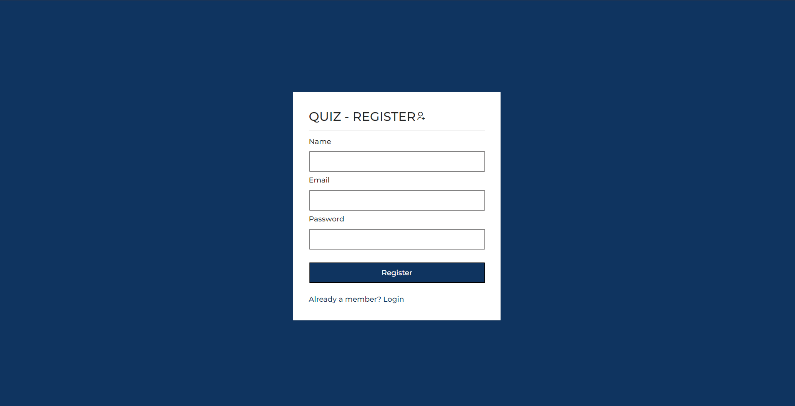
<i><h2>2) Login Page</h2></i>
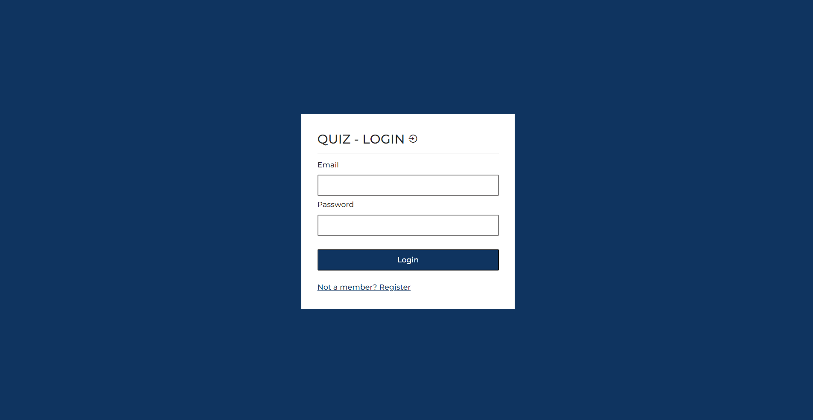
<i><h2>3) Admin Profile Home Page</h2></i>
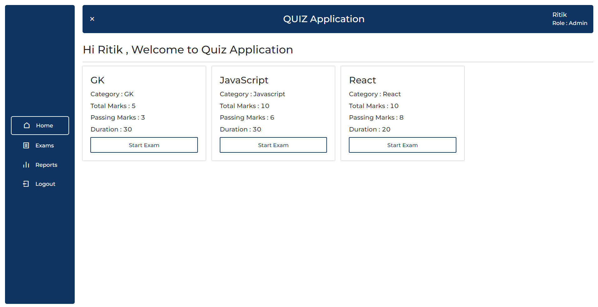
<i><h2>4) Add Quiz Page in which Admin Post the Quiz into the MongoDB Database</h2></i>
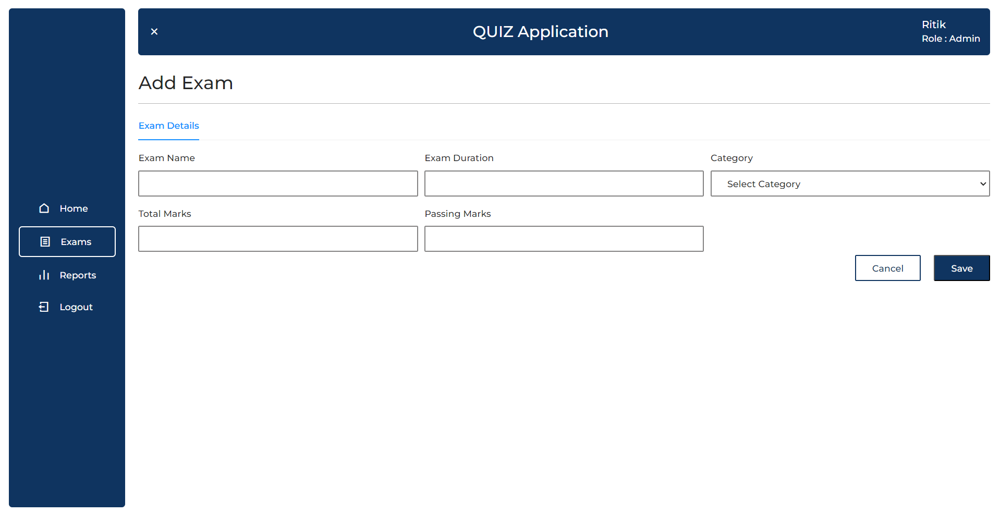
<i><h2>5) Add Questions in Quiz </h2></i>
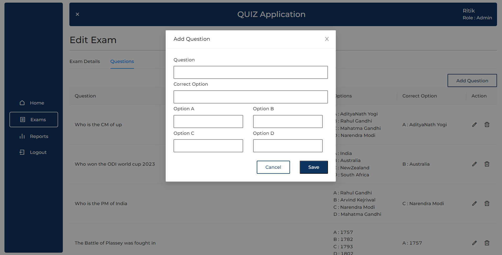
<i><h2>6) Edit Exam by Admin </h2></i>
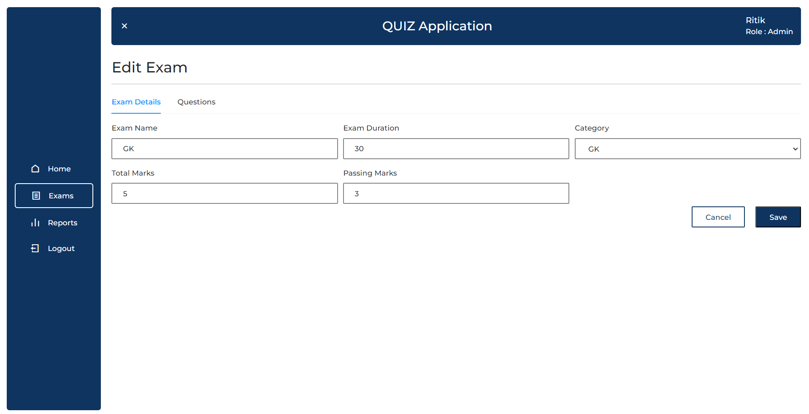
<i><h2>7) Edit Que by Admin </h2></i>
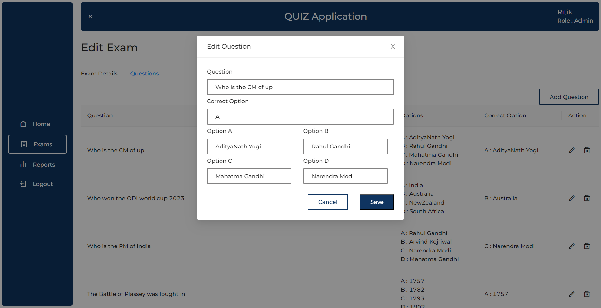
<i><h2>8) User's Profile </h2></i>
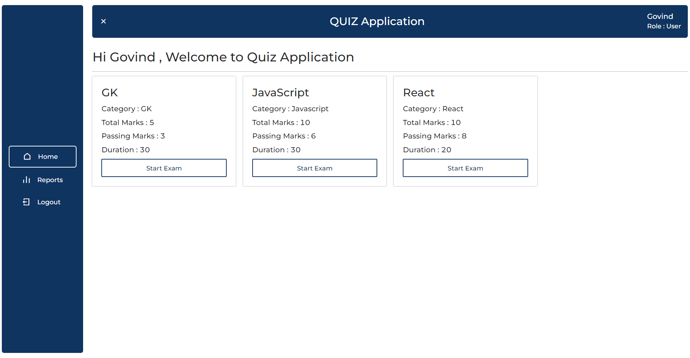
<i><h2>9) Instructions before exam </h2></i>
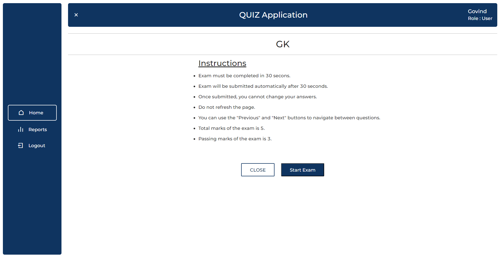

<i><h2>10) User Result</h2></i>
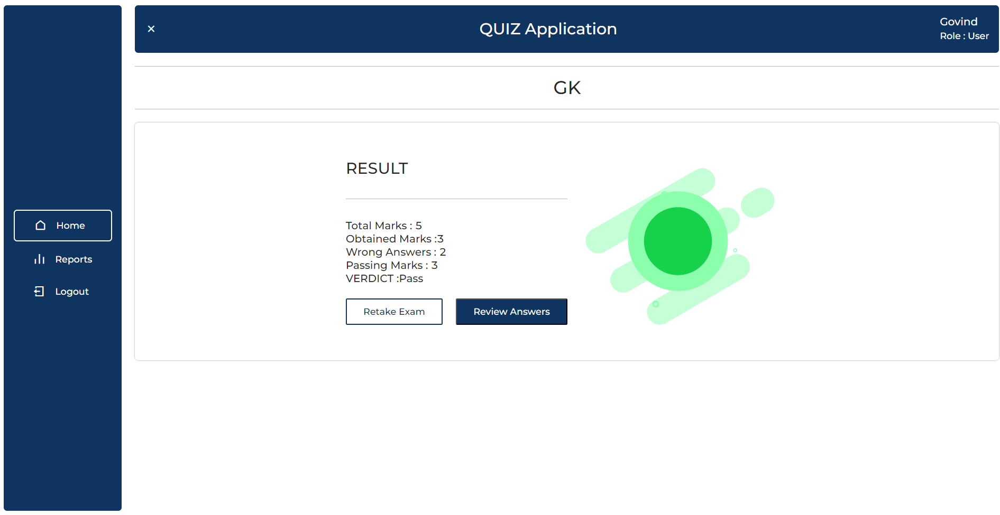

<i><h2>11) Reports of all users that can be seen by only admin </h2></i>
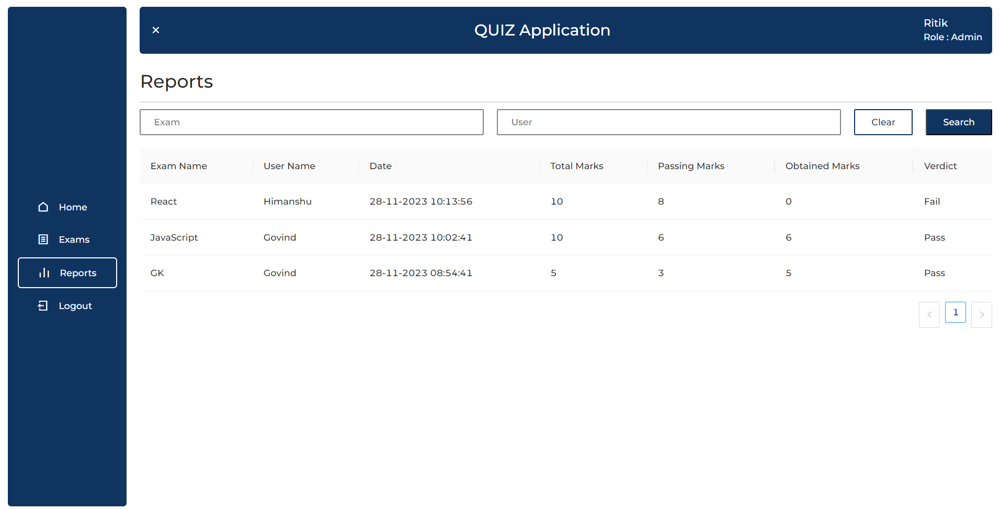
<i><h2>12) User can see only his/her report </h2></i>
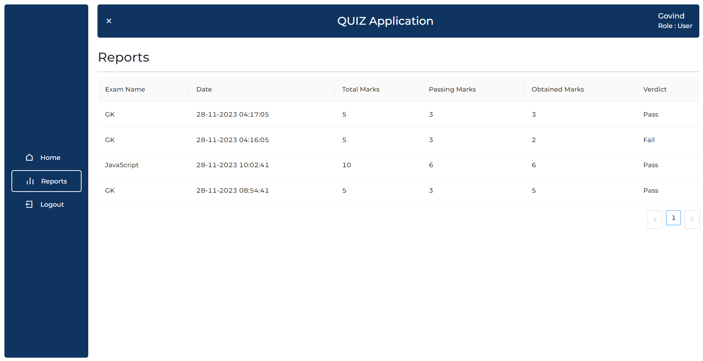